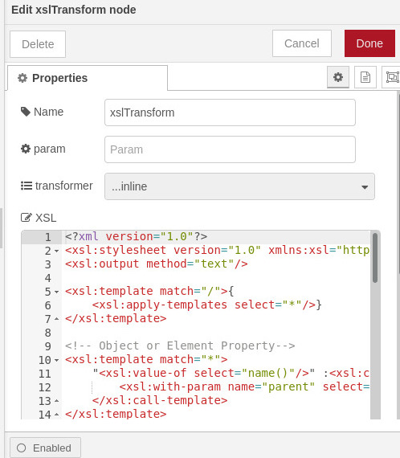
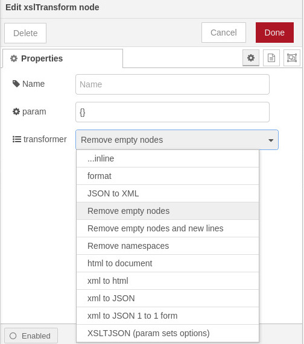

# node-red-contrib-xsltransform
=============================

[Node-Red][1] node to translate xml content using [saxon-js][2].

This node transforms the xml content in msg.payload is valid according the xsl schema provided.
The xsl can be provided or a provided xsl utilised.
Cached xsl can be maintained and name provided in topic in msg or tranform node set to a specific xsl.

------------------------------------------------------------

## xslTransform

Takes in XML and transforms it based inline xsl, cached xsl using id in topic (inline is empty) or from standard provided tranforms.

Inline

Selected from list

------------------------------------------------------------

## xslParse

Loads the content in msg.payload as compiled stylesheet in cache with identifier as either content of msg.stylesheet or if missing the topic.

------------------------------------------------------------

## Install

Install via nodered pallete or run the following command in the root directory of your Node-RED install

    npm install node-red-contrib-xsltransform

Test/example flow in  test/testflow.json

------------------------------------------------------------

## Version

0.5.2 rewrite for saxon.js compile method not available.  Changed caching to internal oblect 

0.4.0 Add pulldown for supplied transforms 

0.3.0 Big rewrite to use [saxon-js][2] as pure javascript and v3 of xslt

0.2.1 base

------------------------------------------------------------

#Author

[Peter Prib][3]

[1]:  http://nodered.org

[2]: https://www.npmjs.com/package/saxon-js

[3]: https://github.com/peterprib

